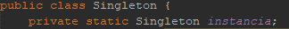
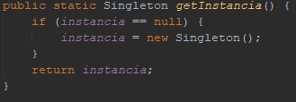
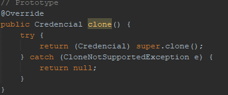
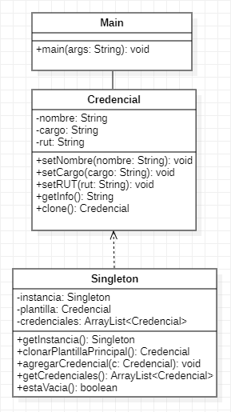
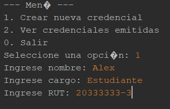
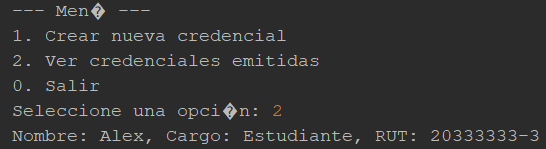
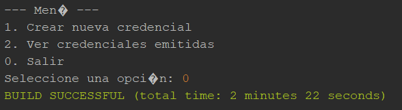

# 🎫 Sistema de Emisión de Credenciales para Eventos
Estudiante(s):
Alex Ibacache – Patrones de Diseño

Este proyecto implementa un sistema en Java para emitir credenciales personalizadas para eventos, aplicando los patrones de diseño **Singleton** y **Prototype**. Cada credencial incluye datos como nombre del asistente, cargo y RUT.

## 🛠️ Patrones de Diseño Implementados

### 🧩 Singleton

La clase `Singleton` asegura que solo exista una instancia de la plantilla base de credencial y gestiona la lista de credenciales emitidas.

#### 📷 Ejemplo en el código:

  
*Constructor privado y atributo estático de instancia.*

  

---

### 🧬 Prototype

La clase `Credencial` permite clonar la plantilla base para crear nuevas credenciales personalizadas.

#### 📷 Ejemplo en el código:

  
*Implementación del método `clone()` en la clase `Credencial`.*

  
## 📋 Funcionalidades

- Crear nuevas credenciales a partir de una plantilla base.
- Visualizar la lista de credenciales emitidas.
- Menú interactivo por consola para gestionar las credenciales.

## 🧩 Estructura del Proyecto

- `Credencial.java`: Clase que representa la credencial individual y permite su clonación.
- `Singleton.java`: Clase Singleton que contiene la plantilla base y la lista de credenciales.
- `Main.java`: Clase principal con el menú de interacción por consola.

## 📌 Diagrama UML



## 📸 Captura del sistema funcionando
  
*Ejemplo de crear una nueva credencial.*

  
*Ver la credenciales guardadas .*

  
*Salir el programa.*
## 🚀 Cómo Ejecutar el Proyecto

1. Clona este repositorio:
   ```bash
    git clone https://github.com/AlexIbacache/Alex-Ibacache-IEI-087.git

2. Abrir el proyecto en el IDE (Entorno de Desarrollo Integrado) para java
   
